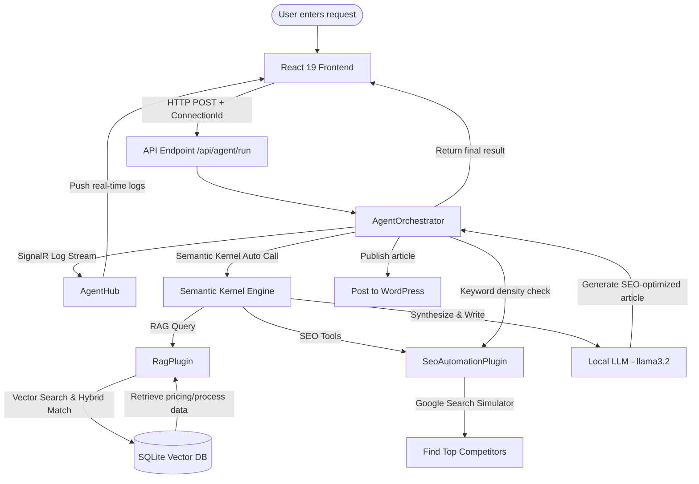

# AI SEO SaaS Platform — Autonomous Multi-Agent & RAG System

An automated Multi-Agent AI system that streamlines the SEO article-writing workflow, optimizing content through a RAG (Retrieval-Augmented Generation) pipeline. It combines **.NET 10**, **Semantic Kernel**, **SQLite Vector Database**, **Ollama (Local LLM)**, and **React 19 (Vite)**.

This project is designed to run entirely locally (or connect to cloud models), securing corporate data and minimizing AI operating costs.

---

## Technology Stack

### 1. Backend (C# .NET Core)
*   **Framework:** `.NET 10.0` (Web API)
*   **AI Agent Orchestration:** `Microsoft.SemanticKernel` (v1.75.0) — Coordinates intelligent agent execution and triggers plugins automatically (Auto Function Calling).
*   **Vector Database:** `SQLite` with `SqliteMemoryStore` (persistent vector storage using the `Microsoft.SemanticKernel.Connectors.Sqlite` package).
*   **Custom Text Embedding:** `OllamaCustomTextEmbedding` — Connects to Ollama's local `/api/embeddings` endpoint to generate vector embeddings.
*   **Real-time Streaming:** `Microsoft.AspNetCore.SignalR` — Streams step-by-step agent execution logs to the frontend in real time.
*   **Excel Parsing (optional):** `MiniExcel` (v1.43.1).

### 2. Frontend (React)
*   **Framework:** `React 19` & `Vite 8` (Ultra-fast development server).
*   **Design & UI:** Custom Glassmorphism UI (premium frosted-glass interface), fully responsive layout, and a dynamic language switcher (EN/VI).
*   **Animations:** `Framer Motion` (v12.38) for smooth, step-by-step transitions of agent logs.
*   **Icons:** `Lucide React` (modern icon pack).
*   **API & Real-time Integration:** `Axios` & `@microsoft/signalr` (receives real-time log streams from the backend).

---

## 📐 Agentic Pipeline Workflow



---

## Detailed Installation Guide

### Prerequisites
1.  **.NET 10 SDK** or higher.
2.  **Node.js** (v18 or higher).
3.  **Ollama** installed locally on your system (Download from [ollama.com](https://ollama.com)).

---

### Step 1: Set Up Local AI Models (Ollama)

Once Ollama is installed and running, download the LLM and Embedding Model by running the following commands in your terminal:

```bash
# Pull the LLM (Default model in appsettings.json is llama3.2)
ollama pull llama3.2

# Pull the Text Embedding Model (Default: nomic-embed-text)
ollama pull nomic-embed-text
```

Ensure Ollama is running in the background at its default address: `http://localhost:11434`.

---

### Step 2: Configure & Run the Backend (.NET Core)

1.  **Configure project (`appsettings.json`):**
    Open `appsettings.json` in the backend root directory and verify the configurations:
    ```json
    {
      "AI": {
        "Endpoint": "http://localhost:11434/v1",
        "ModelId": "llama3.2",
        "EmbeddingModelId": "nomic-embed-text",
        "ApiKey": "ollama_key_dummy"
      },
      "Database": {
        "VectorDbConnectionString": "vector_database.db"
      }
    }
    ```

2.  **Prepare RAG Knowledge Base:**
    *   Create a `KnowledgeBase` folder in the root directory (if it does not exist).
    *   Place `.txt` knowledge files inside this directory. Example:
        *   `ThangHien.txt`: Crane rental pricing details.
        *   `DatPhat.txt`: Drywall construction workflow.
    *   Upon the first startup, `DataSeeder.cs` will automatically read these text files, generate vector embeddings using Ollama, and persist them in the `vector_database.db` SQLite database.

3.  **Run the Backend:**
    Open a terminal at the project root directory and execute:
    ```bash
    # Restore NuGet packages
    dotnet restore

    # Run the application
    dotnet run
    ```
    The backend will start and listen on default .NET ports (typically `http://localhost:5000` or `https://localhost:5001`).

---

### Step 3: Configure & Run the Frontend (React)

1.  **Navigate to the frontend folder:**
    ```bash
    cd frontend
    ```

2.  **Install npm packages:**
    ```bash
    npm install
    ```

3.  **Run the Frontend Dev Server (Vite):**
    ```bash
    npm run dev
    ```
    The web interface will open at `http://localhost:5173`. You can access it via your web browser.

---

## Project Directory Tree

```text
AI-SEO-Ssas-Platform/
│
├── .gitignore                      # Git ignore file configuration
├── AI-SEO-Ssas-Platform.csproj     # .NET 10 project file & NuGet dependencies
├── Program.cs                      # API endpoints, CORS policies, DI container, SignalR Hub
├── appsettings.json                # Configurations for AI models and SQLite Vector DB
├── vector_database.db              # Auto-generated SQLite Vector Database
│
├── KnowledgeBase/                  # Folder containing RAG knowledge text files (.txt)
│   ├── DatPhat.txt                 # Example document: Drywall construction details
│   └── ThangHien.txt               # Example document: Crane rental pricing
│
├── Plugins/                        # Agent plugin definitions (Semantic Kernel Tools)
│   ├── RagPlugin.cs                # Retrieves internal information from the Vector DB
│   └── SeoAutomationPlugin.cs      # Google Top 10 analysis, keyword density, WordPress publisher
│
├── Services/                       # Application logic and services
│   ├── AgentHub.cs                 # SignalR hub streaming real-time logs to the frontend
│   ├── AgentOrchestrator.cs        # Orchestrates the execution of the multi-agent workflow
│   ├── DataSeeder.cs               # Parses text files and seeds the Vector Database on start
│   ├── KernelFactory.cs            # Configures and instantiates the Semantic Kernel
│   ├── LogCollector.cs             # Collects and broadcasts logs to SignalR clients
│   └── OllamaCustomTextEmbedding.cs# Custom text embedding generator linking to local Ollama API
│
└── frontend/                       # React Frontend application
    ├── package.json                # Vite project metadata, React, Framer Motion, and SignalR client
    ├── index.html
    ├── vite.config.js
    └── src/
        ├── main.jsx
        ├── App.jsx                 # Main component managing state, SignalR connection, and layout
        ├── App.css                 # General/cleanup CSS rules
        └── index.css               # Premium Glassmorphism styling and theme configurations
```

---

## GitHub Push Guide

To push your source code to a remote repository on GitHub, follow the steps below. The `.gitignore` file is configured to exclude temporary system folders, build artifacts (`bin/`, `obj/`), `node_modules/`, and the local SQLite database (`vector_database.db`).

1.  **Initialize a local Git repository:**
    ```bash
    git init
    ```

2.  **Stage all changes:**
    ```bash
    git add .
    ```

3.  **Commit the changes:**
    ```bash
    git commit -m "feat: upgrade system to support multilingual orchestrator, case-insensitive SEO analysis, and localized UI"
    ```

4.  **Set the default branch to `main`:**
    ```bash
    git branch -M main
    ```

5.  **Link to your remote GitHub repository:**
    *(Replace the URL below with your actual repository URL)*
    ```bash
    git remote add origin https://github.com/username/repository-name.git
    ```

6.  **Push code to the remote repository:**
    ```bash
    git push -u origin main
    ```

---

## Important Deployment Notes

*   **Embedding Consistency:** The `nomic-embed-text` model must be consistently configured across both Ollama and `appsettings.json`. If you switch models (e.g., to `all-minilm`), ensure the new model has been downloaded via Ollama.
*   **CORS Configuration:** `Program.cs` is configured to allow requests from `http://localhost:5173` (Vite's default address). Update CORS settings in `Program.cs` if you run the frontend on a different port.
*   **Database Refresh:** When updating or adding `.txt` files in the `KnowledgeBase` directory, delete the existing `vector_database.db` file and restart the backend to force a full re-embedding and seeding process.
