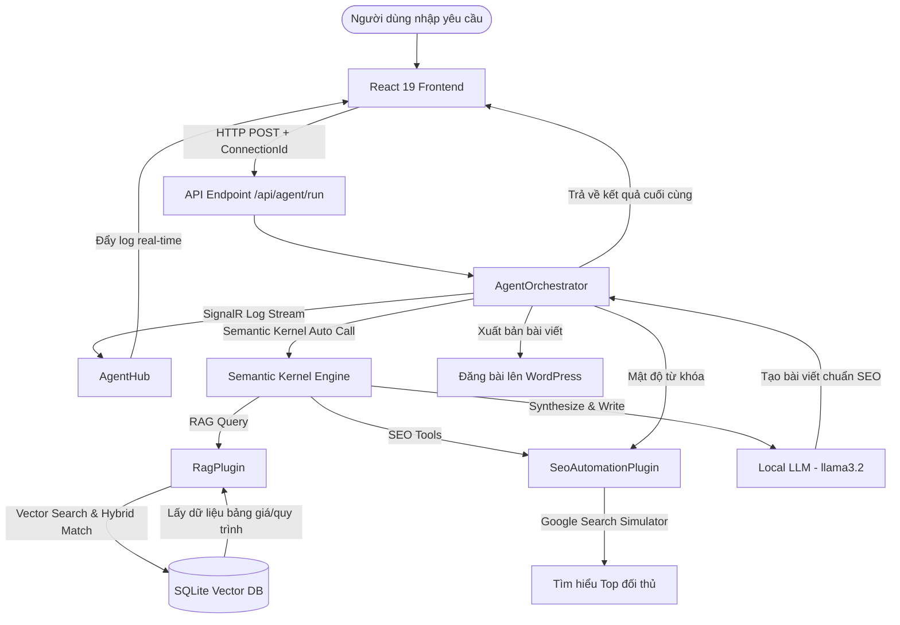

# AI SEO SaaS Platform — Autonomous Multi-Agent & RAG System

Hệ thống Multi-Agent AI tự động hóa quy trình viết bài chuẩn SEO, tối ưu hóa nội dung thông qua mô hình RAG (Retrieval-Augmented Generation) kết hợp giữa **.NET 10**, **Semantic Kernel**, **SQLite Vector Database**, **Ollama (Local LLM)** và **React 19 (Vite)**.

Dự án này được thiết kế để hoạt động hoàn toàn local (hoặc kết nối đám mây), giúp bảo mật dữ liệu doanh nghiệp và tối ưu chi phí vận hành AI.

---

## Công Nghệ Sử Dụng (Technology Stack)

### 1. Backend (C# .NET Core)
*   **Framework:** `.NET 10.0` (Web API)
*   **AI Agent Orchestration:** `Microsoft.SemanticKernel` (v1.75.0) — Điều phối luồng xử lý thông minh và kích hoạt Plugin tự động (Auto Function Calling).
*   **Vector Database:** `SQLite` với `SqliteMemoryStore` (kết nối lưu trữ vector bền vững thông qua thư viện `Microsoft.SemanticKernel.Connectors.Sqlite`).
*   **Custom Text Embedding:** `OllamaCustomTextEmbedding` kết nối với API `/api/embeddings` cục bộ của Ollama để sinh vector nhúng.
*   **Real-time Streaming:** `Microsoft.AspNetCore.SignalR` — Đẩy logs hoạt động của Agent thời gian thực xuống Frontend.
*   **Excel Parsing (nếu cần):** `MiniExcel` (v1.43.1).

### 2. Frontend (React)
*   **Framework:** `React 19` & `Vite 8` (Tốc độ khởi động siêu nhanh).
*   **Thiết kế & Giao diện:** Custom Glassmorphism UI (giao diện kính mờ cao cấp), Responsive Layout.
*   **Hiệu ứng động:** `Framer Motion` (v12.38) giúp các dòng log của Agent xuất hiện mượt mà.
*   **Icons:** `Lucide React` (hệ thống icon hiện đại).
*   **Kết nối API & Real-time:** `Axios` & `@microsoft/signalr` (nhận log stream thời gian thực từ Backend).

---

## 📐 Kiến Trúc Hoạt Động (Agentic Pipeline Workflow)



---

## Hướng Dẫn Cài Đặt Chi Tiết

### Yêu Cầu Hệ Thống (Prerequisites)
1.  **SDK .NET 10** trở lên.
2.  **Node.js** (Phiên bản v18 trở lên).
3.  **Ollama** cài đặt cục bộ trên máy tính của bạn (Tải tại [ollama.com](https://ollama.com)).

---

### Bước 1: Thiết Lập Mô Hình AI Cục Bộ (Ollama)

Sau khi cài đặt Ollama, bạn cần tải về mô hình ngôn ngữ lớn (LLM) và mô hình nhúng (Embedding Model) bằng các lệnh sau trong Terminal/Command Prompt:

```bash
# Tải mô hình ngôn ngữ lớn (Mặc định trong appsettings là llama3.2)
ollama pull llama3.2

# Tải mô hình nhúng văn bản chuẩn (Mặc định: nomic-embed-text)
ollama pull nomic-embed-text
```

Đảm bảo Ollama đang chạy dưới nền tại địa chỉ mặc định `http://localhost:11434`.

---

### Bước 2: Cấu Hình & Khởi Chạy Backend (.NET Core)

1.  **Cấu hình dự án (`appsettings.json`):**
    Mở file `appsettings.json` ở thư mục gốc backend và kiểm tra thông tin cấu hình:
    ```json
    {
      "AI": {
        "Endpoint": "http://localhost:11434/v1",
        "ModelId": "llama3.2",
        "EmbeddingModelId": "nomic-embed-text",
        "ApiKey": "ollama_key_dummy"
      },
      "Database": {
        "VectorDbConnectionString": "vector_database.db"
      }
    }
    ```

2.  **Chuẩn bị tài liệu học cho AI (RAG Knowledge):**
    *   Tạo thư mục `KnowledgeBase` ở thư mục gốc (nếu chưa có).
    *   Đặt các file văn bản tri thức định dạng `.txt` vào thư mục này. Ví dụ:
        *   `ThangHien.txt`: Chứa bảng giá xe cẩu Thắng Hiền.
        *   `DatPhat.txt`: Chứa quy trình thi công của Đạt Phát.
    *   Khi backend khởi chạy lần đầu, lớp `DataSeeder.cs` sẽ tự động đọc các file này, gửi dữ liệu lên Ollama sinh vector nhúng và lưu vào cơ sở dữ liệu `vector_database.db`.

3.  **Khởi chạy Backend:**
    Mở Terminal tại thư mục gốc của dự án và chạy:
    ```bash
    # Khôi phục các thư viện NuGet
    dotnet restore

    # Khởi chạy dự án
    dotnet run
    ```
    Backend sẽ chạy và lắng nghe tại cổng mặc định của .NET (thường là `http://localhost:5000` hoặc `https://localhost:5001`).

---

### Bước 3: Cài Đặt & Khởi Chạy Frontend (React)

1.  **Di chuyển vào thư mục frontend:**
    ```bash
    cd frontend
    ```

2.  **Cài đặt các gói thư viện NPM:**
    ```bash
    npm install
    ```

3.  **Khởi chạy Frontend ở môi trường phát triển (Vite Dev Server):**
    ```bash
    npm run dev
    ```
    Giao diện web sẽ được mở tại địa chỉ `http://localhost:5173`. Bạn có thể truy cập bằng trình duyệt web.

---

## ấu Trúc Dự Án (Project Directory Tree)

```text
AI-SEO-Ssas-Platform/
│
├── .gitignore                      # File cấu hình bỏ qua khi đẩy lên git
├── AI-SEO-Ssas-Platform.csproj     # Cấu hình dự án backend .NET 10 & các NuGet package
├── Program.cs                      # Endpoint API, cấu hình CORS, DI container, SignalR Hub
├── appsettings.json                # File cấu hình kết nối AI Models và SQLite
├── vector_database.db              # SQLite Vector Database (Tự sinh khi chạy)
│
├── KnowledgeBase/                  # Thư mục chứa tài liệu tri thức RAG (.txt)
│   ├── DatPhat.txt
│   └── ThangHien.txt
│
├── Plugins/                        # Thư mục chứa các chức năng bổ trợ cho Agent (Semantic Kernel Tools)
│   ├── RagPlugin.cs                # Tra cứu thông tin từ Vector DB
│   └── SeoAutomationPlugin.cs      # Phân tích Google Top 10, mật độ từ khóa, đăng WordPress
│
├── Services/                       # Thư mục chứa các service xử lý logic
│   ├── AgentHub.cs                 # Hub SignalR để gửi logs real-time về client
│   ├── AgentOrchestrator.cs        # Trái tim điều phối luồng chạy của Multi-Agent
│   ├── DataSeeder.cs               # Đọc file txt và nạp vector vào SQLite khi chạy
│   ├── KernelFactory.cs            # Khởi tạo instance Semantic Kernel
│   ├── LogCollector.cs             # Thu thập log hoạt động của các plugin
│   └── OllamaCustomTextEmbedding.cs# Lớp sinh vector nhúng tùy chỉnh qua API của Ollama
│
└── frontend/                       # Thư mục dự án React
    ├── package.json                # Cài đặt thư viện React, Framer Motion, SignalR client
    ├── index.html
    ├── vite.config.js
    └── src/
        ├── main.jsx
        ├── App.jsx                 # Component chính hiển thị giao diện và logic gửi yêu cầu
        ├── App.css                 # CSS cấu trúc và hoạt họa cho ứng dụng
        └── index.css               # Phong cách nền tảng Glassmorphism và biến màu sắc
```

---

## Hướng Dẫn Đẩy Dự Án Lên Github (Git Push Guide)

Để lưu trữ mã nguồn của bạn và chia sẻ lên Github, hãy làm theo các bước dưới đây. File `.gitignore` ở thư mục gốc đã được thiết lập để loại bỏ các tệp tin rác của hệ thống, thư mục build (`bin/`, `obj/`), `node_modules/`, và cơ sở dữ liệu cục bộ (`vector_database.db`).

1.  **Khởi tạo Git Repository cục bộ:**
    ```bash
    git init
    ```

2.  **Thêm tất cả các tệp tin vào staging area:**
    ```bash
    git add .
    ```

3.  **Tạo bản Commit đầu tiên:**
    ```bash
    git commit -m "feat: init AI SEO Agent platform with .NET 10, Semantic Kernel, and React 19"
    ```

4.  **Thiết lập nhánh chính là `main`:**
    ```bash
    git branch -M main
    ```

5.  **Liên kết với kho chứa từ xa (Remote Repository) trên GitHub:**
    *(Thay thế link bên dưới bằng URL kho chứa của bạn)*
    ```bash
    git remote add origin https://github.com/username/ten-kho-chua.git
    ```

6.  **Đẩy mã nguồn lên GitHub:**
    ```bash
    git push -u origin main
    ```

---

## Lưu Ý Quan Trọng khi Triển Khai
*   **Mô hình nhúng (Embedding):** Model `nomic-embed-text` cần cấu hình đồng bộ ở cả Ollama và `appsettings.json`. Nếu đổi sang model khác (như `all-minilm`), hãy chắc chắn đã `pull` model đó về Ollama trước.
*   **CORS:** File `Program.cs` cấu hình sẵn CORS cho cổng `http://localhost:5173`. Nếu bạn đổi cổng chạy của React frontend, hãy cập nhật lại policy tương ứng tại `Program.cs`.
*   **Database:** Khi thay đổi nội dung file `.txt` trong `KnowledgeBase`, hãy xóa file `vector_database.db` cũ và chạy lại backend để hệ thống tự động nạp lại cơ sở dữ liệu tri thức mới nhất.
